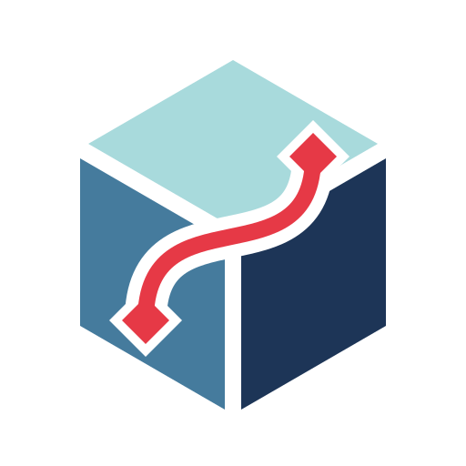
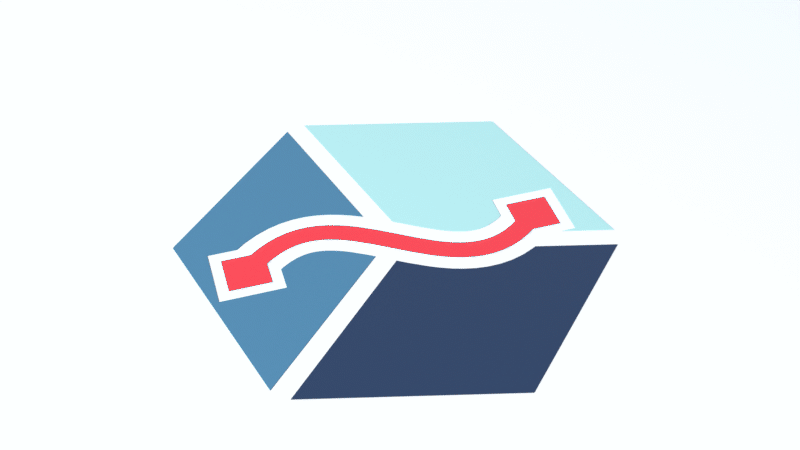
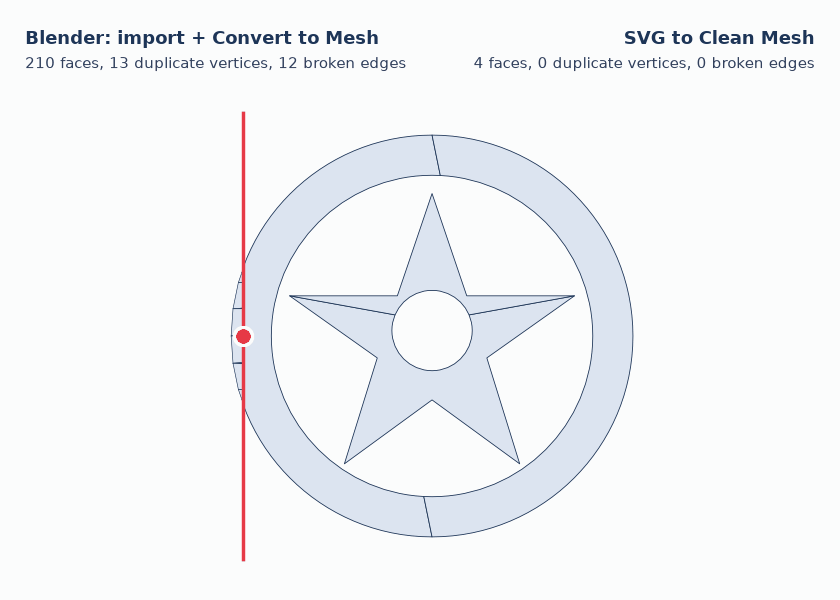
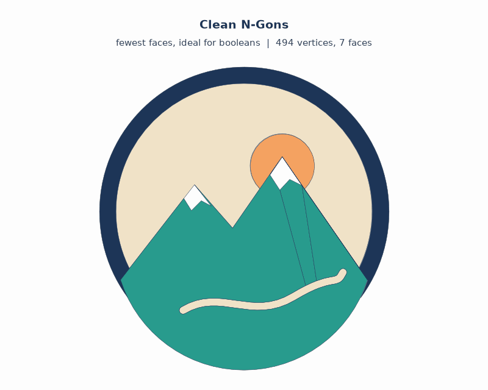
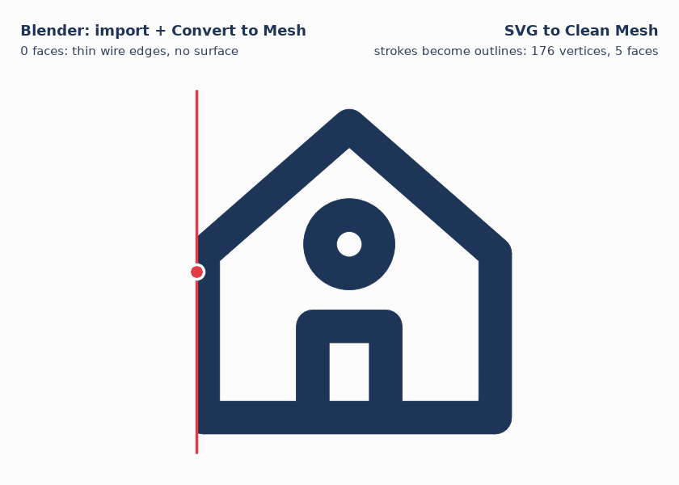
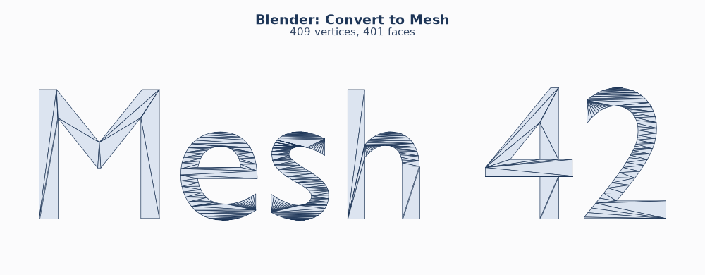
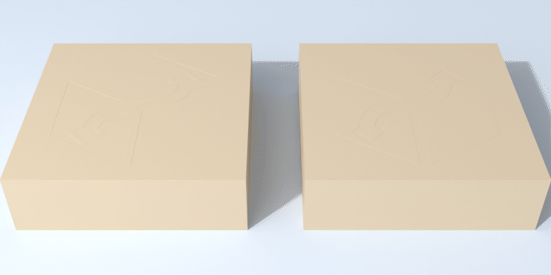
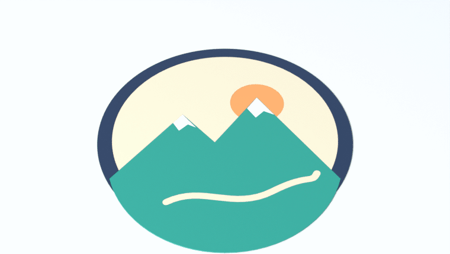
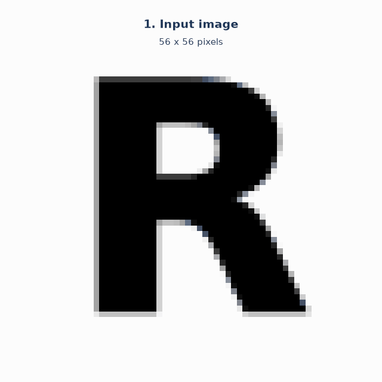
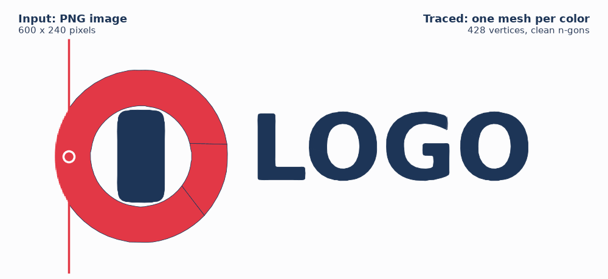

<p align="center">
  
</p>

<h1 align="center">SVG to Clean Mesh</h1>

<p align="center">
  <b>Free Blender add-on: turn SVG files and logo images into clean, manifold meshes,<br>
  ready for booleans, engraving and 3D printing.</b>
</p>

<p align="center">
  <a href="../../releases/latest"></a>
  <a href="../../releases"></a>
  <a href="../../actions/workflows/tests.yml"></a>
  
  <a href="LICENSE"></a>
</p>

<p align="center">
  <a href="../../releases/latest"><b>Download</b></a> |
  <a href="#installation">Installation</a> |
  <a href="#usage">Usage</a> |
  <a href="#main-options">Options</a>
</p>

<p align="center">
  
</p>

**Why this add-on?**

- **One click from SVG to a clean solid.** No more "convert to mesh, merge by distance, fill holes, fix normals". Every result is closed and manifold, so booleans just work.
- **Logos from images, too.** Drop in a PNG or JPG and get smooth vector curves and a clean mesh, single- or multi-colored, without Inkscape or any other tool.
- **Geometry you can keep working with.** Choose minimal n-gons for booleans, or an even triangle/quad mesh for subdivision, sculpting and deformation.

<p align="center"></p>

*Left of the divider: Blender's default workflow (import the SVG as curves, then "Convert to Mesh") with stacked overlapping layers, sliver triangles and duplicate vertices. Right: this add-on, a few clean n-gons.*

## The problem

Blender only imports SVGs as curves. Converting them to meshes gives you:

- long, thin sliver triangles and triangle fans,
- every shape as its own surface stacked on top of the others (white areas become geometry instead of holes),
- duplicate vertices and open, non-manifold edges,
- no surface at all for line icons that only use strokes,
- no thickness, and extruding through the curve often leaves broken normals.

That is bad news for booleans: the Exact solver gets slow or produces artifacts.

## What the add-on does

| Feature | Description |
|---|---|
| **Import SVG as Mesh** | Reads the SVG itself (paths incl. arcs, rectangles, circles, polygons, groups, transforms, CSS classes, `<use>`, strokes) and builds a mesh directly. |
| **Trace Image to Mesh** | Vectorizes PNG/JPG/... automatically, either single-color (brightness/transparency) or multi-color (color clustering). Can also save the result as SVG. |
| **Curves to Clean Mesh** | Converts existing curve and **text objects** (e.g. SVGs you already imported) into clean meshes. |
| **Depth per object** | Gives every color its own height: stacked by paint order, or (optional) suggested by AI based on what the logo shows. |
| **Boolean helper** | Uses the selected objects as boolean cutters (engrave/emboss) on the active object with a single click. |

### Clean geometry

- **Closed and manifold.** Extruded objects are watertight solids with outward-facing normals.
- **No overlaps, no duplicate vertices.** All shapes are triangulated together, so intersections are resolved exactly.
- **Fill rules as in the SVG** (`nonzero`/`evenodd`). Holes in letters (O, A, B ...) are detected correctly.
- **"What you see"**: shapes painted on top cut away what lies below them. **White is treated as a hole**, e.g. white text on a red circle. This is optional.
- **Adaptive curve resolution.** Tight curves get more points, straight lines get none they don't need.
- Optionally **one object per color**. The borders between neighbouring colors match exactly, without gaps. Materials are created from the SVG colors; Z offset between layers (as in the image at the top) and planar UVs are available too.

### Four topologies

<p align="center"></p>

- **Clean N-Gons**: minimal geometry, one cap face per region and quads on the sides. **Ideal for booleans.**
- **Triangles**: constrained Delaunay triangulation that only uses the outline vertices (fewest possible triangles; long edges lead to fans).
- **Uniform Triangles**: evenly sized triangles for displacement, cloth and deformation.
- **Quads**: quad-dominant grid for subdivision and sculpting.

### Strokes and line icons

<p align="center"></p>

Outlines (`stroke`) are turned into real geometry with the correct width, line caps and joins. Blender's own importer ignores them, so line icons end up as wire edges without any surface.

### Text objects

<p align="center"></p>

*Curves to Clean Mesh* also works on Blender text objects and on curves you already have in your scene.

### Booleans

<p align="center"></p>

The extruded meshes are closed solids, so the Exact boolean solver handles them reliably. The sidebar has one-click **Cut** (engrave) and **Add** (emboss) buttons.

### Depth per object (optional AI suggestions)

<p align="center"></p>

The collapsed **Depth per Object** section in the sidebar gives every selected object its own height (colorful artwork is imported as one object per color by default):

- **Terrace by Order**: each layer stands on the ground and is a bit higher than the one below it, as in the image above. No AI, no internet.
- **Split into Parts**: splits objects into their separate parts, so that for example a mustache can get another height than the eyes of the same color. Tiny parts stay together in one "details" object. Parts that touch each other stay together; separate those in Edit Mode (select with *L*, then *P > Selection*).
- **Suggest with AI** (optional): an AI looks at a small preview of the selected objects and suggests how thick each of them should be, e.g. sky thin, mountains thicker, snow caps on top, a river thinner than the land around it. With **Same Bottom** (default) every object starts at the same bottom and only gets thicker or thinner; turn it off to let the AI also lift or sink objects. An optional hint such as "keychain", "wall sign" or "stamp" steers the result, and *Split Parts First* lets it judge every part on its own. A progress bar shows while the AI is answering (usually 10 to 40 seconds); it can be cancelled. The reason for each height is shown for the active object, and **Re-apply** rescales everything to a new base depth.

*Base Depth* is the thickness that height 1.0 corresponds to. Leave it at 0 (automatic) to use the current thickness of the selected objects, also after scaling them.

To use the AI suggestions, open *Edit > Preferences > Add-ons > SVG to Clean Mesh* and choose an **AI Service**; Blender's *Allow Online Access* (Preferences > System > Network) must be enabled. Nothing is sent unless you press *Suggest with AI*. Each request sends two small preview images of the selected objects (the artwork and a map of the regions), their colors, names and sizes, and your hint.

| AI Service | Setup | Cost per request (estimate) |
|---|---|---|
| **Claude (Anthropic)** | API key from platform.claude.com (or `ANTHROPIC_API_KEY`) | Opus 5.5 about 3-8 cents, Sonnet 5.5 about 2-4 cents, Haiku 4.5 under 1 cent |
| **OpenAI or compatible** | API key from platform.openai.com (or `OPENAI_API_KEY`), any vision model; also LM Studio, OpenRouter and other OpenAI-compatible servers via *Server* | depends on the model |
| **Ollama (local)** | Install Ollama and run `ollama pull gemma3` (or another vision model such as `qwen2.5vl`) | free, runs on your computer |

Which model is enough? The task is mainly recognizing what the regions show and stacking them sensibly. Simple logos work with the small models (Haiku 4.5, small local models); for illustrations with many parts (faces, mascots) the larger models judge noticeably better. A request is small (two images of at most 512 pixels plus a list of regions, roughly 2,000 to 4,000 tokens in and 1,000 to 3,000 out including thinking), so even the largest Claude model costs only a few cents.

### Image -> vector -> mesh

<p align="center"></p>

Tracing runs entirely inside the add-on (only numpy, which ships with Blender). No external programs such as Inkscape or potrace are needed:

1. Find the foreground: transparency, brightness (Otsu threshold, background detected automatically) or k-means color clusters. *Auto* picks the color mode by itself when the image has several distinct colors.
2. Small, smooth images (for example logos saved from a website) are enlarged internally to about 1000 pixels, so hair-thin lines, small text and letter holes survive.
3. Hard-edged images get a light blur against pixel stairs; smooth images keep all their detail.
4. Marching squares with sub-pixel accuracy, which also makes use of the image's anti-aliasing.
5. Remove specks, detect corners, smooth the contours.
6. Straight edges are recognized as exact lines, and the corners between them are sharpened again by intersecting the lines.
7. Curves are fitted with Bezier fitting (Schneider's algorithm). A square becomes 4 segments, a circle a few smooth curves.
8. Optionally **save as SVG**; from there the same mesh pipeline as the SVG import is used.

Multi-colored images are split into one mesh per color:

<p align="center"></p>

## Installation

1. Download `svg_to_mesh-<version>.zip` from the [Releases](../../releases) page (or build it yourself with `python build.py`; the ZIP ends up in `dist/`). Do not unzip it.
2. In Blender:
   - **Blender 4.2 and newer:** *Edit > Preferences > Get Extensions*, open the drop-down menu in the top right corner, choose *Install from Disk...* and select the ZIP.
   - **Blender 3.6 to 4.1:** *Edit > Preferences > Add-ons > Install...*, select the ZIP and enable the checkbox.

Tested with Blender 5.0 and 5.2 LTS. Minimum version is 3.6.

**Updating:** from version 1.3.0 on, press *Check for Updates* at the bottom of the sidebar panel (or in the add-on preferences). If a newer release exists, *Install Update* downloads it from GitHub, verifies its checksum and installs it; restart Blender afterwards. The add-on never checks on its own.

## Usage

The panel lives in the **3D Viewport > Sidebar (N) > "SVG Mesh" tab**. Alternatively:

- *File > Import > SVG as Clean Mesh (.svg)* or *Image Trace to Mesh*
- **Drag and drop** an `.svg` into the 3D Viewport (Blender 4.1+; Blender asks which importer to use)
- *Object > Convert > Clean Mesh (from Curve/Text)* for existing curves and text

> **Tip:** After importing, press **F9** (or open the "Adjust Last Operation" panel at the bottom left) to change every setting live, such as threshold, colors, topology or depth. The result is rebuilt immediately.

### Engraving a logo into an object (example workflow)

1. *Import SVG as Mesh* (or *Trace Image to Mesh*) with topology **Clean N-Gons**, **Extrude** on and **Center Depth** on
2. Place the logo on the surface so that it pokes through it
3. Select the logo, then Shift-click the target object (it is now active)
4. Sidebar: **Cut** (engrave) or **Add** (emboss)
5. The cutter is hidden as wireframe and stays editable. With "Apply Immediately" the modifier is applied right away.

### Main options

| Option | Meaning |
|---|---|
| Topology | N-Gons / Triangles / Uniform Triangles / Quads (see above) |
| Grid Size | Cell size for Uniform/Quads, relative to the object size |
| Curve Precision | Maximum deviation from the true curve (in % of the size). Smaller = rounder |
| Extrude / Depth / Center Depth | Thickness of the solid, optionally symmetric around Z=0 |
| Objects | *Auto* (one object for single-color artwork, one per color otherwise) / single object / per color / per shape |
| Overlaps | *Visible Only* (how the SVG looks) or *Union* (every shape complete) |
| White | *Background Only* (default): white that touches the outside, such as a background rectangle, is removed, also where it shows through letter holes; enclosed white (eyes, white letters) is kept. *Always a Hole*: every white area is a cut-out. *Keep*: white is solid like any color |
| Skip Effects | Leave out strongly blurred shapes (shadows, glows, highlights) |
| Min Opacity | Leave out fills and strokes more transparent than this (shading layers) |
| Layer Offset | Z offset between separated objects |
| Size | Scale to a size (*Fit*) or use the real document size (*Real*, e.g. mm from the SVG) |
| **Tracing:** Mode | Auto (detects several colors) / Brightness / Transparency / Colors |
| Edge Smoothing / Curve Smoothing | Smoothing against pixel stairs and noise |
| Fit Tolerance | How closely the Bezier curves follow the pixels (px) |
| Corner Angle | Direction changes sharper than this become corners |
| Despeckle | Specks and holes smaller than this (px²) are removed |
| Save SVG | Also save the traced vectors as an SVG file |

## Limitations

- SVG `<text>` is not supported. Convert text to paths first (Inkscape: *Path > Object to Path*) or use Blender text with *Curves to Clean Mesh*.
- Gradients become the average of their colors. `mask`, patterns and dashes (`stroke-dasharray`) are ignored; filters are only used to recognize soft effects (see *Skip Effects*).
- Tracing is meant for logos, icons and graphics with clear color areas, not for photos.
- Very large or deeply nested files are rejected (more than 200,000 elements after expanding `<use>`, or more than 400 nesting levels) to protect against malicious files.

## How it works

```
SVG -------- parser --+
Image ------ tracer --+--> Bezier shapes --> adaptive subdivision --> polygons
Curve/Text -----------+                                                  |
                                                                         v
  1. Constrained Delaunay triangulation of all shapes together
  2. Winding number per triangle via flood fill (fill rule, visibility, groups)
  3. Extract and clean the boundary loops of every object
  4. Rebuild:  N-gons (CDT with hole handling)
               Triangles / uniform (CDT + Steiner grid)
               Quads (join triangles into quads, smooth)
  5. Extrude into a closed solid, add UVs and materials
```

- `svg_to_mesh/core/` is plain Python without `bpy`, so it can be tested outside Blender: SVG parser, geometry and strokes, tracer, Bezier fitting, SVG writer.
- `svg_to_mesh/mesh_builder.py` contains the triangulation and mesh construction (`mathutils`, `bmesh`).
- `svg_to_mesh/pipeline.py`, `operators.py` and `ui.py` connect everything to Blender.

## Development and tests

```bash
pip install pytest numpy bpy==5.0.1   # bpy = Blender as a Python module (for the integration tests)
python -m pytest
```

The tests in `tests/test_blender.py` run against real Blender, through the `bpy` module and on GitHub also inside Blender 5.2 LTS, and check, among other things, that the solids are manifold, that volumes are correct and that booleans work. Without `bpy` they are skipped.

The images in `docs/` are generated with `python tools/make_docs_images.py` (needs `bpy` and `matplotlib`; the 3D images are rendered with Cycles).

### Making a release

Add a section for the new version to `CHANGELOG.md`, bump `version` in `svg_to_mesh/blender_manifest.toml` (and `bl_info` in `__init__.py`) and push. The **Release** workflow runs the tests, builds the ZIP and publishes it as release `v<version>` (if that release does not exist yet). Pushing a tag `v<version>` or starting the workflow manually under *Actions* works too.

## Contributing

Bug reports, sample SVGs that do not import well, and pull requests are welcome; please open an [issue](../../issues). If the add-on saves you time, a star on GitHub helps other Blender users find it.

## License

GPL-3.0-or-later (as required for Blender add-ons).
