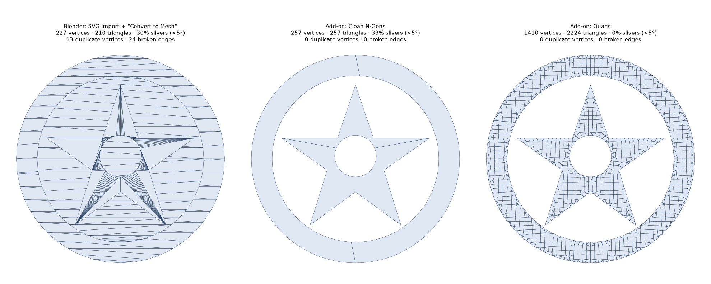
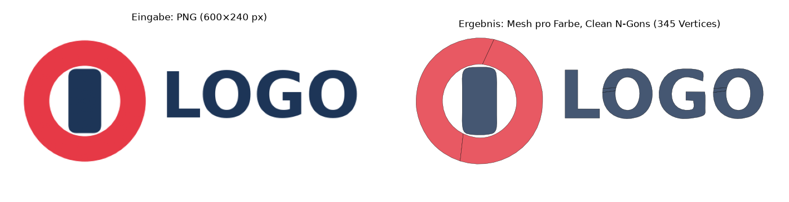

# SVG to Clean Mesh – Blender Add-on

Import **SVG files directly as clean meshes** and **trace images (e.g. logos) automatically into vectors and meshes**, with geometry that is pleasant to work with, especially for **booleans** (engraving, embossing, cutting).



*Left: Blender's default workflow (import the SVG as curves, then "Convert to Mesh"): stacked overlapping layers, sliver triangles, duplicate vertices. Middle/right: this add-on, either as minimal n-gons or as an even quad grid.*

**[⬇ Download the latest release](../../releases/latest)**

## The problem

Blender only imports SVGs as curves. Converting them to meshes gives you:

- long, thin sliver triangles and triangle fans,
- every shape as its own surface stacked on top of the others (white areas become geometry instead of holes),
- duplicate vertices and open, non-manifold edges,
- no thickness, and extruding through the curve often leaves broken normals.

That is bad news for booleans: the Exact solver gets slow or produces artifacts.

## What the add-on does

| Feature | Description |
|---|---|
| **Import SVG as Mesh** | Reads the SVG itself (paths incl. arcs, rectangles, circles, polygons, groups, transforms, CSS classes, `<use>`, strokes) and builds a mesh directly. |
| **Trace Image to Mesh** | Vectorizes PNG/JPG/… automatically, either single-color (brightness/transparency) or multi-color (color clustering). Can also save the result as SVG. |
| **Curves to Clean Mesh** | Converts existing curve and **text objects** (e.g. SVGs you already imported) into clean meshes. |
| **Boolean helper** | Uses the selected objects as boolean cutters (engrave/emboss) on the active object with a single click. |

### Clean geometry

- **Closed and manifold.** Extruded objects are watertight solids with outward-facing normals.
- **No overlaps, no duplicate vertices.** All shapes are triangulated together, so intersections are resolved exactly.
- **Fill rules as in the SVG** (`nonzero`/`evenodd`). Holes in letters (O, A, B …) are detected correctly.
- **"What you see"**: shapes painted on top cut away what lies below them. **White is treated as a hole**, e.g. white text on a red circle. This is optional.
- **Adaptive curve resolution.** Tight curves get more points, straight lines get none they don't need.
- **Four topologies to choose from:**
  - **Clean N-Gons**: minimal geometry, one cap face per region and quads on the sides. **Ideal for booleans.**
  - **Triangles**: constrained Delaunay triangulation without sliver fans.
  - **Uniform Triangles**: evenly sized triangles for displacement, cloth and deformation.
  - **Quads**: quad-dominant grid for subdivision and sculpting.
- Optionally **one object per color**. The borders between neighbouring colors match exactly, without gaps. Materials are created from the SVG colors; Z offset between layers and planar UVs are available too.

### Image → vector → mesh



Tracing runs entirely inside the add-on (only numpy, which ships with Blender). No external programs such as Inkscape or potrace are needed:

1. Find the foreground: transparency, brightness (Otsu threshold, background detected automatically) or k-means color clusters.
2. Light blur against pixel stairs and noise.
3. Marching squares with sub-pixel accuracy, which also makes use of the image's anti-aliasing.
4. Remove specks, detect corners, smooth the contours.
5. Straight edges are recognized as exact lines, and the corners between them are sharpened again by intersecting the lines.
6. Curves are fitted with Bézier fitting (Schneider's algorithm). A square becomes 4 segments, a circle a few smooth curves.
7. Optionally **save as SVG**; from there the same mesh pipeline as the SVG import is used.

## Installation

1. Download `svg_to_mesh-<version>.zip` from the [Releases](../../releases) page (or build it yourself with `python build.py`; the ZIP ends up in `dist/`).
2. In Blender:
   - **Blender 4.2 and newer:** *Edit → Preferences → Get Extensions → ⌄ (top right) → Install from Disk…* → choose the ZIP
   - **Blender 3.6 – 4.1:** *Edit → Preferences → Add-ons → Install…* → choose the ZIP → enable the checkbox

Tested with Blender 5.0. Minimum version is 3.6.

## Usage

The panel lives in the **3D Viewport → Sidebar (N) → "SVG Mesh" tab**. Alternatively:

- *File → Import → SVG as Clean Mesh (.svg)* or *Image Trace to Mesh*
- **Drag & drop** an `.svg` into the 3D Viewport (Blender 4.1+; Blender asks which importer to use)
- *Object → Convert → Clean Mesh (from Curve/Text)* for existing curves and text

> **Tip:** After importing, press **F9** (or open the "Adjust Last Operation" panel at the bottom left) to change every setting live, such as threshold, colors, topology or depth. The result is rebuilt immediately.

### Engraving a logo into an object (example workflow)

1. *Import SVG as Mesh* (or *Trace Image to Mesh*) with topology **Clean N-Gons**, **Extrude** on and **Center Depth** on
2. Place the logo on the surface so that it pokes through it
3. Select the logo, then Shift-click the target object (it is now active)
4. Sidebar → **Cut** (engrave) or **Add** (emboss)
5. The cutter is hidden as wireframe and stays editable. With "Apply Immediately" the modifier is applied right away.

### Main options

| Option | Meaning |
|---|---|
| Topology | N-Gons / Triangles / Uniform Triangles / Quads (see above) |
| Grid Size | Cell size for Uniform/Quads, relative to the object size |
| Curve Precision | Maximum deviation from the true curve (in % of the size). Smaller = rounder |
| Extrude / Depth / Center Depth | Thickness of the solid, optionally symmetric around Z=0 |
| Objects | Single object / per color / per shape |
| Overlaps | *Visible Only* (how the SVG looks) or *Union* (every shape complete) |
| White = Hole | White areas become holes or are ignored |
| Size | Scale to a size (*Fit*) or use the real document size (*Real*, e.g. mm from the SVG) |
| **Tracing:** Mode | Auto / Brightness / Transparency / Colors |
| Edge Smoothing / Curve Smoothing | Smoothing against pixel stairs and noise |
| Fit Tolerance | How closely the Bézier curves follow the pixels (px) |
| Corner Angle | Direction changes sharper than this become corners |
| Despeckle | Specks and holes smaller than this (px²) are removed |
| Save SVG | Also save the traced vectors as an SVG file |

## Limitations

- SVG `<text>` is not supported. Convert text to paths first (Inkscape: *Path → Object to Path*) or use Blender text with *Curves to Clean Mesh*.
- Gradients become the color of their first stop. `clipPath`, `mask`, filters and dashes (`stroke-dasharray`) are ignored.
- Tracing is meant for logos, icons and graphics with clear color areas, not for photos.

## How it works

```
SVG ─────parser─┐
Image ───tracer─┼─► Bézier shapes ─► adaptive subdivision ─► polygons
Curve/Text ─────┘                                                │
          Constrained Delaunay (all shapes together) ◄───────────┘
          Winding number per triangle via flood fill (fill rule, visibility, groups)
          Extract and clean boundary loops per object
          ├─ N-gons (CDT with hole resolution)
          ├─ Triangles / uniform (CDT + Steiner grid)
          └─ Quads (+ join triangles into quads, smooth)
          Extrude into a closed solid, UVs, materials
```

- `svg_to_mesh/core/` is plain Python without `bpy`, so it can be tested outside Blender: SVG parser, geometry and strokes, tracer, Bézier fitting, SVG writer.
- `svg_to_mesh/mesh_builder.py` contains the triangulation and mesh construction (`mathutils`, `bmesh`).
- `svg_to_mesh/pipeline.py`, `operators.py` and `ui.py` connect everything to Blender.

## Development & tests

```bash
pip install pytest numpy bpy   # bpy = Blender as a Python module (for the integration tests)
python -m pytest
```

The tests in `tests/test_blender.py` run against real Blender through the `bpy` module and check, among other things, that the solids are manifold, that volumes are correct and that booleans work. Without `bpy` they are skipped.

### Making a release

Bump `version` in `svg_to_mesh/blender_manifest.toml` (and `bl_info` in `__init__.py`) and push. The **Release** workflow runs the tests, builds the ZIP and publishes it as release `v<version>` (if that release does not exist yet). Pushing a tag `v<version>` or starting the workflow manually under *Actions* works too.

## License

GPL-3.0-or-later (as required for Blender add-ons).
